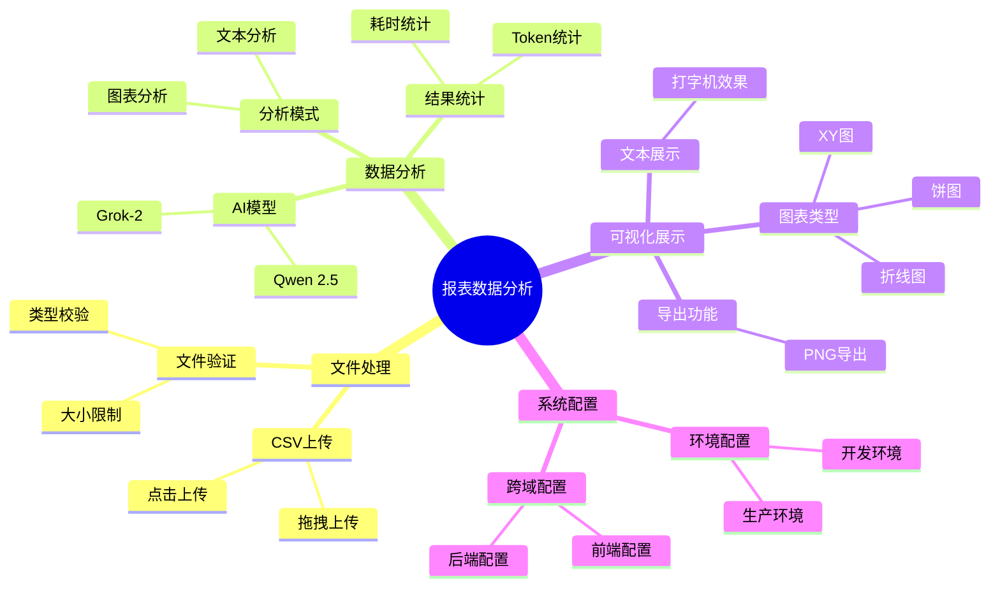
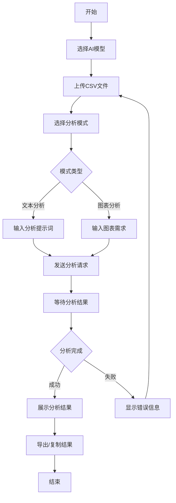
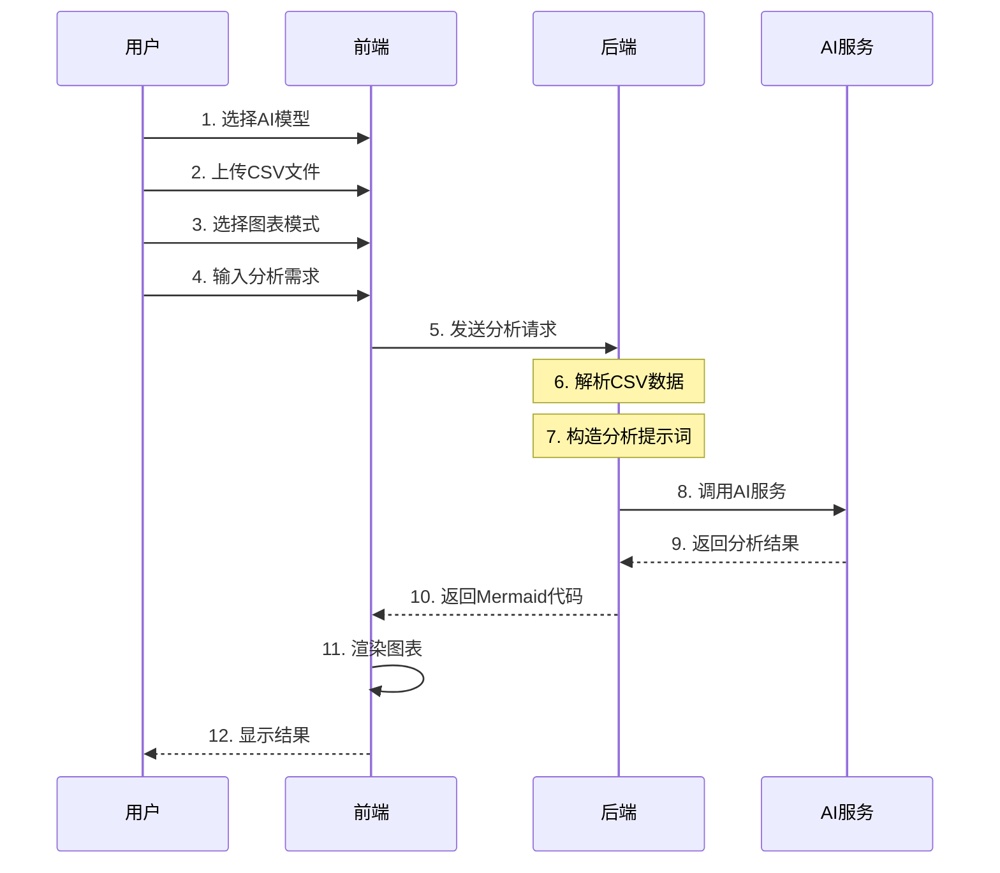

# 报表数据分析服务

这是一个基于 Open WebUI REST API 的智能报表数据分析服务，当然也可以接 LM Studio，anythingLLM 这些本地模型部署； 支持文本分析和图表可视化。

<p style="color: red;">注意：这个项目只是一个 demo 练习项目，所以没有考虑性能和稳定性，请勿直接用于生产环境。</p>

## 项目概览

### 功能架构



### 使用流程



### 图表渲染流程



## 项目结构

```
webai01/
├── frontend/                # 前端项目目录
│   ├── src/
│   │   ├── api/            # API 接口
│   │   ├── components/     # 通用组件
│   │   │   ├── ChartAnalysis.vue    # 图表分析组件
│   │   │   ├── TextAnalysis.vue     # 文本分析组件
│   │   │   └── TypeWriter.vue       # 打字机效果组件
│   │   ├── views/          # 页面组件
│   │   │   └── ReportAnalysis.vue   # 主页面
│   │   ├── router/         # 路由配置
│   │   ├── App.vue         # 根组件
│   │   └── main.js         # 入口文件
│   ├── .env                # 开发环境配置
│   ├── .env.production     # 生产环境配置
│   └── package.json        # 前端依赖配置
├── src/                    # 后端项目目录
│   ├── config/            # 配置文件
│   ├── controllers/       # 控制器
│   │   └── analysisController.js  # 分析控制器
│   ├── services/          # 服务层
│   │   └── llmService.js          # AI服务
│   └── app.js             # 后端入口文件
├── .env                   # 后端环境配置
├── package.json           # 后端依赖配置
└── README.md             # 项目文档
```

## 功能特点

### 核心功能

- 支持 CSV 文件上传与解析
- 基于 AI 的智能数据分析
- 多种图表可视化展示
- 分析结果导出
- 多种 AI 模型支持

### 详细功能

1. **文件处理**

   - 支持拖拽或点击上传 CSV 文件
   - 文件大小限制：10MB
   - 自动文件类型校验

2. **数据分析**

   - 支持自定义分析提示词
   - 支持多种 AI 模型选择
     - Grok-2
     - Qwen 2.5
   - 实时分析状态显示
   - 详细的分析统计（耗时、Tokens）

3. **可视化功能**
   - 支持多种图表类型：
     - 饼图：适用于占比分析
     - 折线图：适用于趋势分析
     - XY 图：适用于相关性分析
   - 图表导出（PNG 格式）
   - 文字分析结果展示
   - 打字机效果展示

## 技术架构

### 前端技术栈

- Vue.js
- Element UI
- Mermaid.js
- Axios

### 后端技术栈

- Node.js
- Express
- Open WebUI API

## 安装和使用

### 环境要求

- Node.js >= 14.0.0
- npm >= 6.0.0

### 后端服务安装

1. 安装依赖：

```bash
npm install
```

2. 配置环境变量：
   复制 `.env.example` 为 `.env` 并填写：

```env
PORT=3001
LLM_API_URL=your_api_url
LLM_API_KEY=your_api_key
REQUEST_TIMEOUT=600000
```

3. 启动服务：

```bash
npm run dev  # 开发环境
npm start    # 生产环境
```

### 前端服务安装

1. 进入前端目录：

```bash
cd ./frontend
```

2. 安装依赖：

```bash
npm install
```

3. 配置环境变量：
   - 开发环境：配置 `.env`
   - 生产环境：配置 `.env.production`

```env
VUE_APP_API_URL=http://your_server_ip:3001
```

4. 启动服务：

```bash
npm run serve  # 开发环境
npm run build  # 生产环境构建
```

## API 使用说明

### 分析报表数据

- **接口**：POST /api/analyze
- **请求格式**：multipart/form-data
- **参数**：
  - file: CSV 文件
  - prompt: 分析提示词
  - mode: 分析模式 (text/chart)
  - model: AI 模型选择

### CSV 文件要求

- 编码：UTF-8

## 注意事项

1. **性能考虑**

   - 文件大小限制：10MB
   - API 超时设置：600s
   - 由于模型的上下文限制，建议合理控制输入的 tokens 数量

2. **跨域配置**

   - 前端需配置正确的 API 地址
   - 后端已配置 CORS 支持

3. **错误处理**
   - 文件格式验证
   - API 异常处理
   - 图表渲染异常处理

## 贡献指南

欢迎提交问题和改进建议！请遵循以下步骤：

1. Fork 本仓库
2. 创建您的特性分支
3. 提交您的改动
4. 推送到您的分支
5. 创建 Pull Request

## 许可证

MIT License
