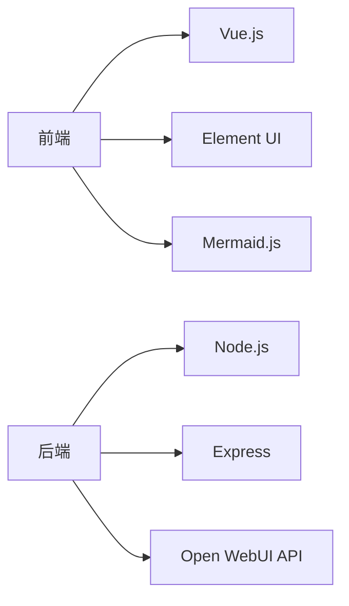
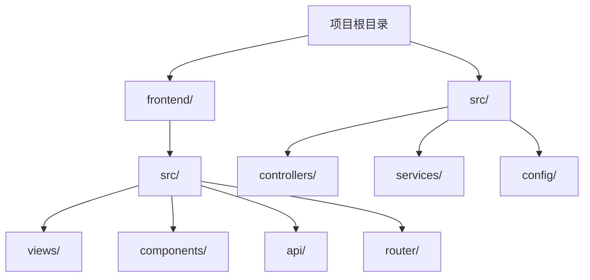
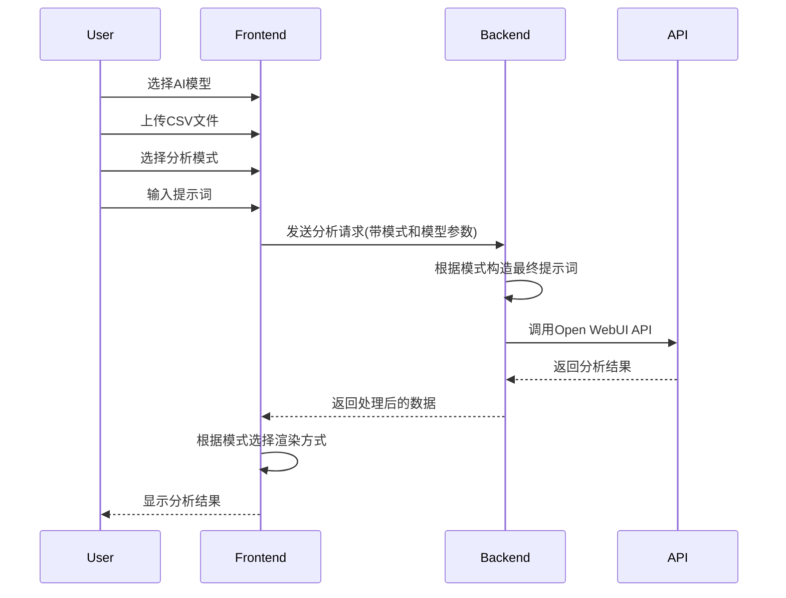

# 项目功能记录与开发笔记

## 1. 当前功能概述

### 1.1 核心功能

- CSV 文件上传与解析
- 基于提示词的数据分析
- Mermaid.js 图表可视化
- 分析结果导出
- AI 模型选择

### 1.2 具体功能点

1. **文件处理**

   - 支持 CSV 文件上传（拖拽/点击）
   - 文件大小限制：10MB
   - 文件类型校验

2. **数据分析**

   - 支持自定义提示词分析
   - 集成 Open WebUI REST API
   - 分析过程状态显示
   - 分析结果统计（耗时、Tokens）
   - 支持图表/文本分析模式切换
   - 根据模式自动构造分析提示词
   - 支持多种 AI 模型选择
     - Grok-2
     - Qwen 2.5

3. **可视化展示**
   - Mermaid.js 图表渲染
   - 支持多种图表类型：
     - 饼图：适用于占比分析
     - 折线图：适用于趋势分析
     - XY 图：适用于相关性分析
   - 图表配置：

```javascript
mermaid.initialize({
  startOnLoad: true,
  theme: "default",
  securityLevel: "loose",
  pie: {
    useWidth: 800,
    useHeight: 600,
    textPosition: 0.5,
    labelPosition: 0.5,
    showLegend: true,
    legendPosition: "bottom",
  },
  xyChart: {
    width: 800,
    height: 600,
    backgroundColor: "#f8f9fa",
    titleColor: "#2c3e50",
    xAxisLabelColor: "#2c3e50",
    yAxisLabelColor: "#2c3e50",
    plotColorPalette: "#409EFF, #67C23A, #E6A23C, #F56C6C",
  },
});
```

4. **结果处理**
   - 图表导出（PNG 格式）
   - 文字分析结果展示
   - 打字机效果展示

### 1.3 技术栈



### 1.4 项目结构



## 2. 待优化功能

- [ ] 数据预处理功能
- [ ] 更多图表类型支持
- [ ] 分析历史记录
- [ ] 批量文件处理
- [ ] 数据导出格式扩展
- [ ] 实时分析进度显示
- [ ] 支持更多 AI 模型
- [ ] 模型参数自定义配置

## 3. 关键代码片段

### 3.1 文件上传验证

```javascript
beforeUpload(file) {
  const isCSV = file.type === 'text/csv' || file.name.endsWith('.csv');
  const isLt10M = file.size / 1024 / 1024 < 10;

  if (!isCSV) {
    this.$message.error('只能上传 CSV 文件!');
    return false;
  }
  if (!isLt10M) {
    this.$message.error('文件大小不能超 10MB!');
    return false;
  }

  return true;
}
```

### 3.2 图表渲染流程



## 4. 注意事项

1. CSV 文件要求：

   - 编码：UTF-8

2. 性能考虑：

   - 文件大小限制
   - API 超时设置（600s）
   - 图表渲染优化

3. 错误处理：

   - 文件上传验证
   - API 请求异常
   - 图表渲染失败

4. 跨域配置：
   - 前端配置：
     ```javascript
     const api = axios.create({
       baseURL: process.env.VUE_APP_API_URL || "http://localhost:3001",
       timeout: 600000,
     });
     ```
   - 后端配置：
     ```javascript
     app.use(
       cors({
         origin: "*",
         methods: ["GET", "POST"],
         allowedHeaders: ["Content-Type", "Authorization"],
       })
     );
     ```

## 5. 更新日志

### 2024-12-27

- 实现基础文件上传功能
- 完成 Mermaid.js 图表集成
- 添加分析结果展示
- 实现图表导出功能

### 2024-12-28

- 新增分析模式切换功能
  - 添加图表/文本分析模式选择
  - 优化 UI 交互体验
  - 自动根据模式构造提示词
  - 更新提示词输入提示

### 2024-12-30

- 新增 AI 模型选择功能
  - 支持多种模型选择（Grok-2, Qwen 2.5）
  - 优化模型选择 UI 布局
  - 添加模型参数传递
  - 完善跨域访问配置

---

_注：此文档将持续更新，记录项目开发过程中的重要信息和经验。_
