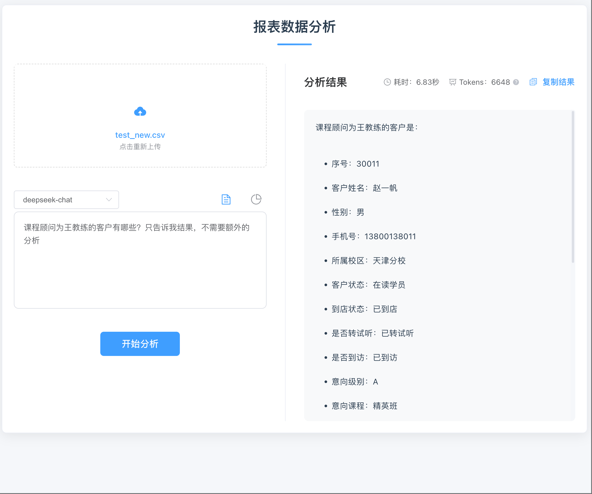

# 打造智能报表分析助手：Vue + Node.js + open webui + AI 实战指南 🚀

> 还在为繁琐的报表分析发愁吗？让 AI 来解放你的双手吧！
> 本文将带你一步步实现一个智能报表分析系统。


## 前篇必备

1. 本地已经部署了 ollama 语言模型，可以参考[ollama 部署](https://juejin.cn/post/7457812218509377587?searchId=202501112130318169459CF109E0378099)
2. 本地已经部署了 open webui，可以参考[open webui 部署](https://juejin.cn/post/7347667306460577843?searchId=20250111213346F35C67629F82723BD14E)；官方文档参考[open webui](https://docs.openwebui.com/)

## 一、项目背景 🤔

在日常工作中，我们经常需要分析各种报表数据。传统的方式通常是：

1. 打开 Excel 📊
2. 盯着数字发呆 😵‍💫
3. 手动制作图表 📈
4. 写分析报告 ✍️
5. 改了又改... 😮‍💨
6. 将数据发送给第三方平台又担心数据安全问题 😢

这个过程不仅耗时，而且容易出错。如果有一个 AI 助手能帮我们自动完成这些工作，那该多好啊！

## 二、解决方案 💡

### 2.1 技术选型

> 技术栈

- 前端：Vue.js + Element UI
- 后端：Node.js + Express
- AI：Open WebUI REST API
- 图表：Mermaid.js
- 文件处理：Multer

### 2.2 系统架构


## 三、核心功能实现 ⚙️

### 3.1 文件上传组件

```vue
<template>
  <el-upload
    class="upload-demo"
    drag
    :action="uploadUrl"
    :before-upload="beforeUpload"
  >
    <i class="el-icon-upload"></i>
    <div class="el-upload__text">将文件拖到此处，或<em>点击上传</em></div>
  </el-upload>
</template>
```

### 3.2 AI 分析服务

```javascript
async function analyzeWithAI(csvData, prompt) {
  try {
    const response = await axios.post(AI_API_URL, {
      messages: [
        { role: "system", prompt: getSystemPrompt() },
        { role: "user", prompt: getUserPrompt(csvData, prompt) },
      ],
    });
    return response.data;
  } catch (error) {
    console.error("AI分析失败 😢", error);
    throw error;
  }
}
```

### 3.3 图表渲染

````javascript
  extractContent(content) {
    // 提取 Mermaid 代码和文字分析
    const mermaidMatch = content.match(/```mermaid\n([\s\S]*?)```/);
    const mermaidCode = mermaidMatch ? mermaidMatch[1].trim() : "";

    // 提取文字分析（Mermaid代码后的所有内容）
    let textAnalysis = "";
    if (mermaidMatch) {
      textAnalysis = content
        .slice(content.indexOf("```mermaid") + mermaidMatch[0].length)
        .trim();
    }

    return {
      mermaidCode,
      textAnalysis,
    };
  },
  async renderChart() {
      try {
        this.loading = true;
        this.error = null;
        // 提取 Mermaid 代码和文字分析
        const { mermaidCode, textAnalysis } = this.extractContent(this.content);

        // 清空之前的内容
        const chartContainer = this.$refs.mermaidChart;
        chartContainer.innerHTML = "";

        // 创建一个新的 pre 元素来包含 mermaid 代码
        const pre = document.createElement("pre");
        pre.className = "mermaid";
        pre.textContent = mermaidCode;
        chartContainer.appendChild(pre);

        // 渲染新图表
        await mermaid.run();

        // 设置文字分析内容
        this.textAnalysis = textAnalysis;

        this.loading = false;
      } catch (error) {
        console.error("图表渲染失败:", error);
        this.error = "图表渲染失败，请检查语法是否正确";
        this.loading = false;
      }
    }
````

## 四、使用效果 ✨




### 4.1 分析模式

1. **文本分析** 📝

   - 自动生成分析报告
   - 突出关键数据点
   - 提供决策建议

2. **图表分析** 📊
   - 饼图展示占比
   - 折线图显示趋势
   - XY 图分析关联

### 4.2 实际案例

假设我们有一份销售数据：


只需要上传 CSV 文件，选择分析模式，AI 就能自动生成这样的图表和分析报告！

## 五、未来规划 🎯

- [ ] 支持更多图表类型
- [ ] 添加数据预处理功能
- [ ] 优化 AI 分析效果
- [ ] 增加批量处理能力
- [ ] 添加导出 PDF 功能

## 六、项目地址 🔗

```bash
git clone https://github.com/yuanyang749/report-analysis.git
/** 服务端 **/
npm install
npm run serve
/** 前端 **/
cd ./frontend
npm install
npm run dev
```

## 结语 🎉

正如某位不愿透露姓名的产品经理说过：

> "这个需求很简单，就是要把 Excel 自动化..."

结果我们不仅实现了自动化，还加入了 AI 的魔法！🎨

希望这个项目能帮助到同样被报表分析困扰的你。如果觉得有帮助，别忘了点个 Star！⭐️

---
